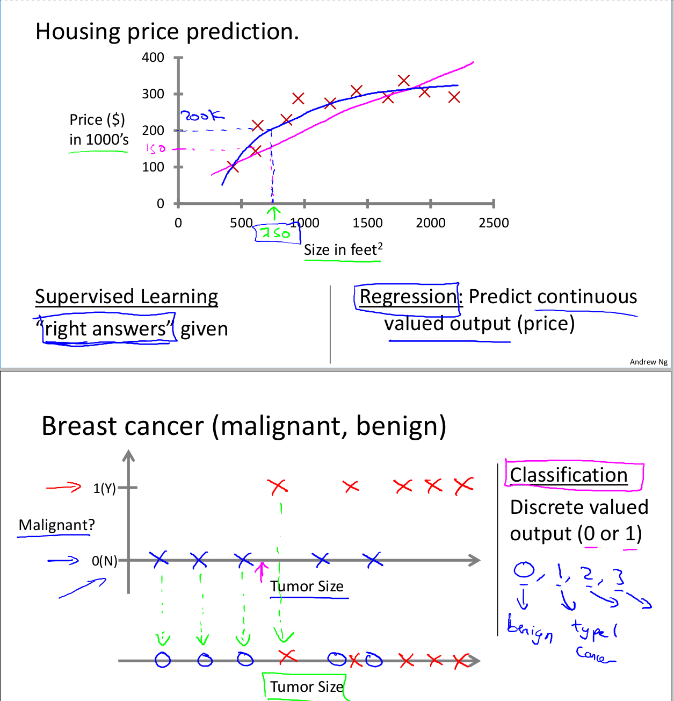
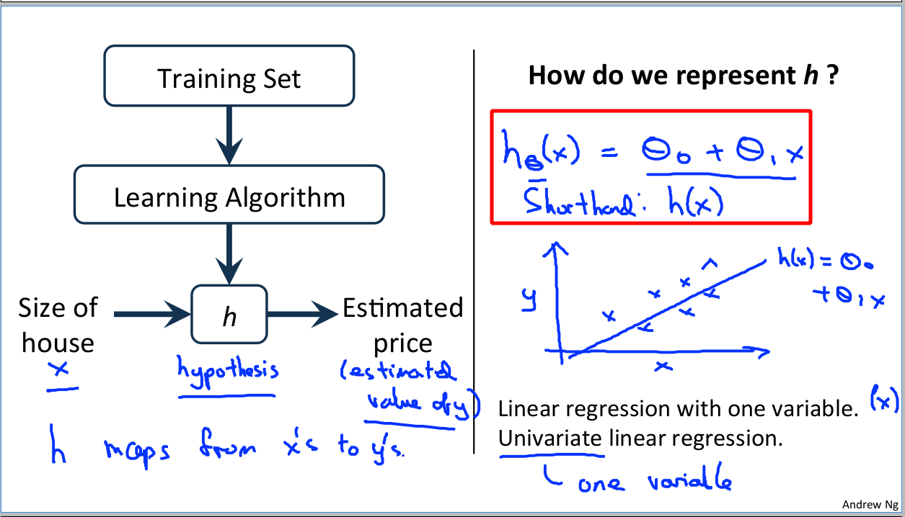
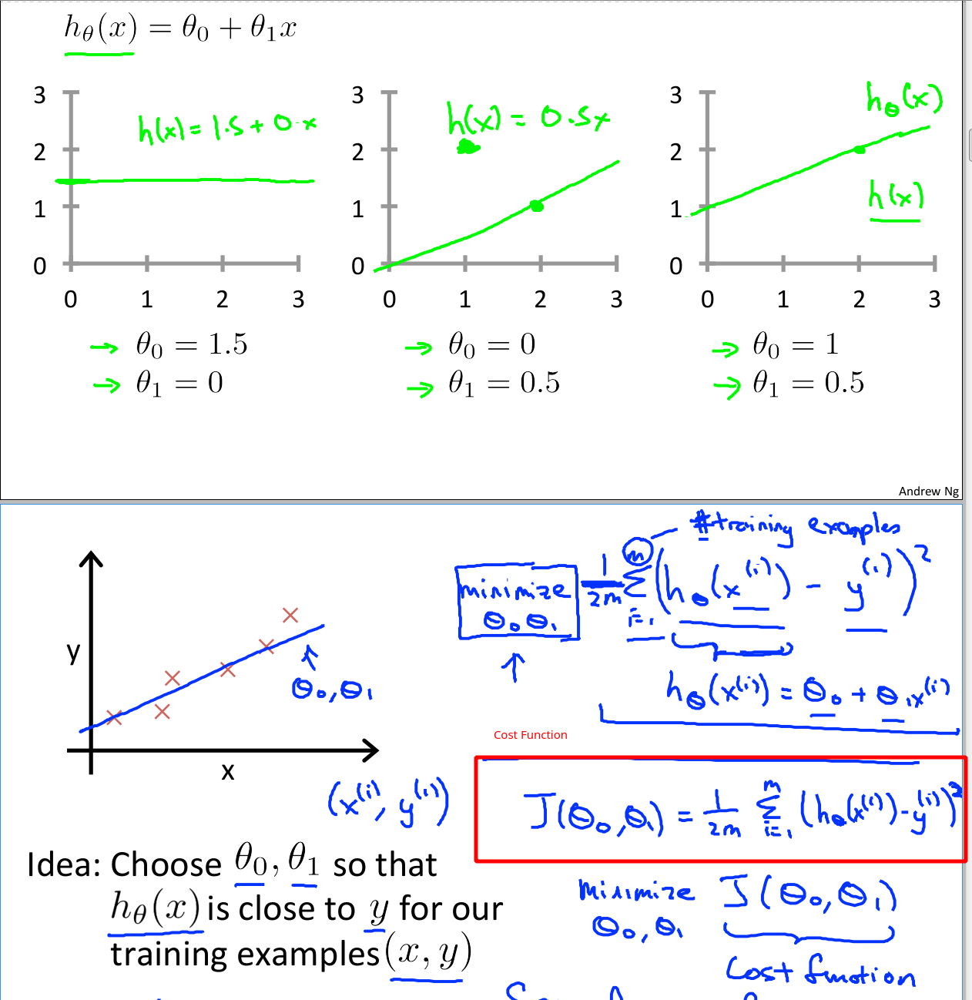
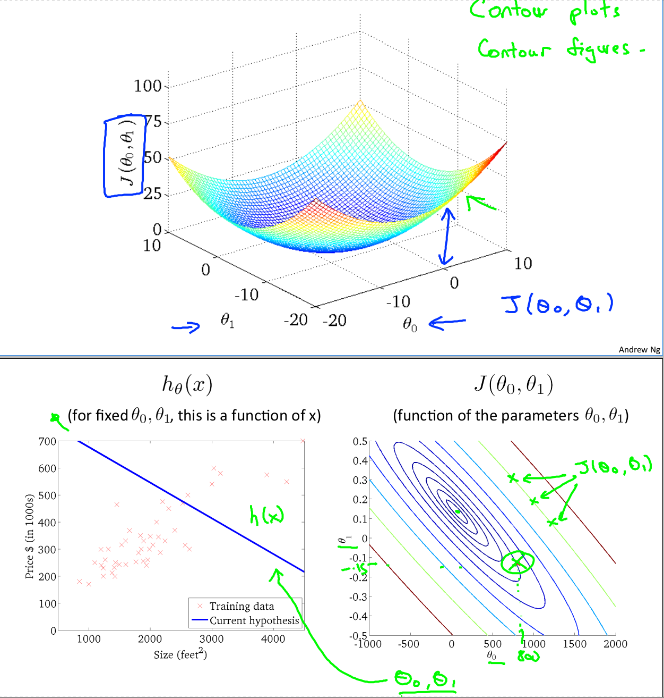
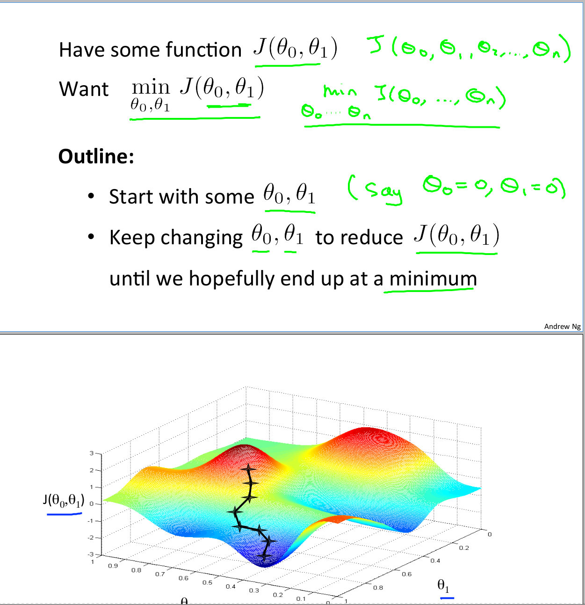
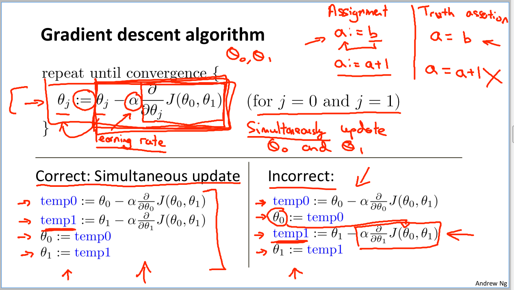
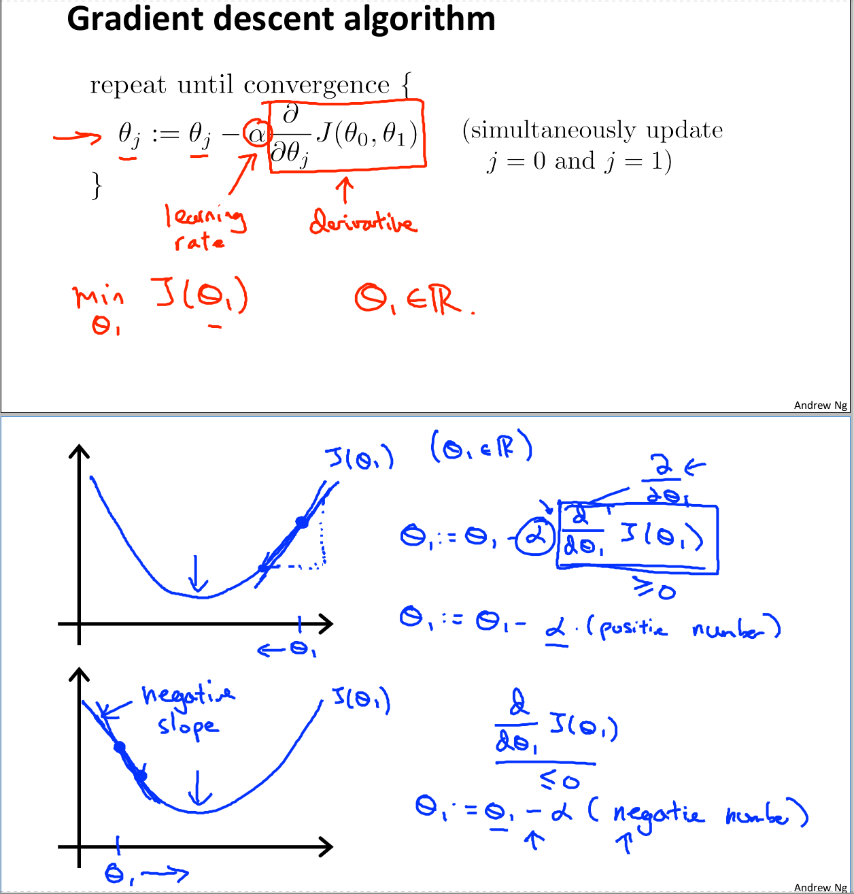

# Machine Learning with Andrew NG
## Andrew NG

# Introduction | Week 1
- Machine Learning is prolific.
- Grew out of AI research
- There is no agreed upon definition of **Machine Learning**.
- Arthur Samuel (1959) wrote a checkers program that kicked his butt.
- Tom Mitchell (1998):
> A computer program is said to learn from experience E with respect to some task T and some performance measure P, if its performance on T, as measured by P, improves with experience E.

- There are two kinds of Machine Learning:
  1. Supervised Learning.
  2. Unsupervised Learning.

- You solve the **Cocktail Party Problem** using:
```octave
[W,s,v] = svd((repmat( sum(x.*x,1), size(x,1) ,1).*x)*x')
```
- Where:
  * `svd` is the **Singular Value Decomposition**
  * `repmat` is Repeat matrix or N-D array.
- Using m instead of n for number.
- Function h is a hypothesis function s.t. h(x) maps to y.

- Andrew uses instead of like most texts do with Linear Regression.

- The idea is to minimize the difference between the data and your Model.

- The **Gradient Descent Algorithm** is:

- In Octave Code, it looks like:


- Alpha is the learning rate; how big the step is.
- The algorithm’s updates should be simultaneous.
- If alpha is too small, then it takes significant time.
- If alpha is too big, then it will continue to overstep - maybe never converge.
- One should auto-scale alpha downwards.
- Linear Regression / Cost function is always a Convex Function
- Therefore, it always has a minimum.

# Linear Regression with Multiple Features | Week 2

# Logistic Regression | Week 3

# Neural Networks: Representation | Week 4

# Neural Networks: Learning | Week 5

# Advice For Applying Machine Learning | Week 6

# Support Vector Machines | Week 7

# Clustering | Week 8

# Anomaly Detection | Week 9

# Large Scale Machine Learning | Week 10

# Application Example: Photo OCR | Week 11
